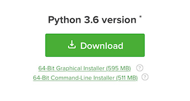

# Python on your own computer

To be able to program on your own computer you need two different programs: the interpreter itself and a good editor:

1. **Anaconda**, a version of Python that is easy to install. There are *a lot* of packages included, which contain functionalities for graphs, statistics and a host of other features.

2. **Atom**, an *editor* to write code in. This is, in a way, just a text writing program, but specifically meant for programming code. For example, it highlights particular parts of your code in specific colors, so you maintain oversight over your code.

Stuck? Consult an assistant!

### Step 1: Anaconda

This package can be downloaded at their [website](https://www.anaconda.com/download/). Choose to download the "**Graphical Installer**" for the latest **Python-version**. The download is over 500MB large, so it could take a while before it's done! You do not need to provide your mail address, even without it you're allowed to use Anaconda.

{:style="max-width:35%"}

As soon as the download is finished, you have to execute the downloaded file (double click?). Follow the installation instructions and choose "Install for me only" where you can; if everything is okay you don't need to alter anything else.

Note: for Windows always choose the "advanced" installation and tick the following box! If you did not, you have to reinstall anaconda!

The installation can take a while.

{:style="max-width:25%"}

### Step 2: Atom

This package can be downloaded at their [website](https://atom.io/). Once again you have to execute the downloaded file. This time though you do not have to alter any settings during the installation process. Are you on a Mac? Just move the file to your applications folder. From there you can simply run it.

## Testing

Now that you have installed both Anaconda and Visual Studio Code, we can see if everything runs smoothly. Follow the examples from the video:

### Terminal

In Visual Studio Code you can open a terminal with the key combination **ctrl**+**\`**. That means pressing both **ctrl** and **\`** (this key is often found next to the 1 or the Z key on your keyboard) at the same time.

Some keyboard shortcuts that might save you some time:

* Use  **ctrl**+**\`** to switch from editor to terminal and vice versa
* If you type a file name in the terminal you can use **tab** for autocomplete
* Want to use a previous command? Use arrow keys (up and down) to navigate through previous commands

### Install `checkpy`

To help you verify whether a program functions in compliance wit the specifications of an assignment, we have written a program of our own called **checkpy**. This program can be installed from the terminal using the following command (make sure to have Python and PiP installed):

	pip install checkpy

This can take a while and you will see some text move over your screen. Afterwards `checkpy` is installed. In addition `checkpy` we also need the tests that correspond to the assignments that you'll have to make. These tests can be downloaded by executing the following command in the terminal:

	checkpy -d uva-sp/sp1

To test that your installation of `checkpy` was successful, you can test `hello.py`. If you haven't written that program yet, check out the introductory video above. Then execute the following command:

	checkpy hello

Is everything colored green and do you see only happy smileys? That means you've done a-okay, and that you've met our requirements for the assignment! Should there still be some red smileys, no worries! Carefully examine your code and verify it with each of the specifications. And don't forget you can always send us an email if you're stuck.
